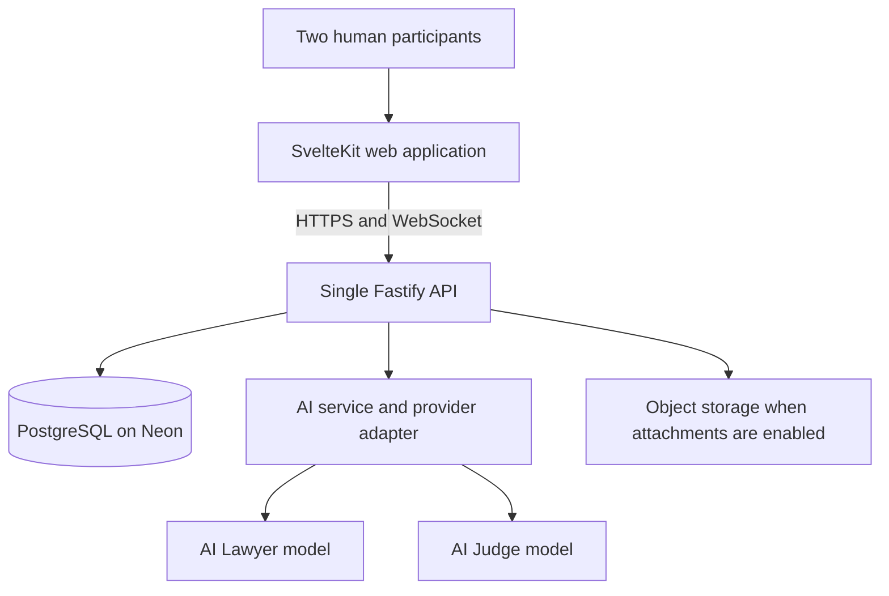

# Architecture

## Design constraint

Debatr is deliberately simple: a private application for at most ten users during its first year. The architecture should be modular enough to replace an AI provider or add an agent, but it must not introduce operational complexity without a present need.

## System overview

## Responsibilities

### Web application

Renders the debate interface, private Lawyer panel, and judge report. It does not decide turns, permissions, scores, or AI prompts.

### API

The Fastify API is the authoritative server. It authenticates users, enforces debate state and turn rules, persists data, broadcasts realtime events, constructs AI requests, validates AI output, and authorises exports/imports.

### Database

PostgreSQL is the source of truth for users, debates, messages, state transitions, pinned facts/evidence, moderation events, and judge reports.

### AI service

The AI service loads version-controlled runtime prompts, builds bounded context, selects the assigned model, calls the provider through an adapter, validates structured output, and records request metadata necessary for debugging and cost review.

## AI provider boundary

Application code uses an internal provider interface rather than a provider SDK directly. The initial provider is OpenCode Zen, called directly through the provider adapter using `OPENCODE_API_KEY`; it is chosen for acceptable privacy/retention terms and compatible API access, not for free-tier suitability. Lawyers and Judges use separately configured models (model IDs confirmed after evaluation). Users cannot choose models.

## Explicitly excluded infrastructure

No Redis, message broker, Kubernetes, horizontal scaling, database sharding, or multiple API instances are required for the initial release.
