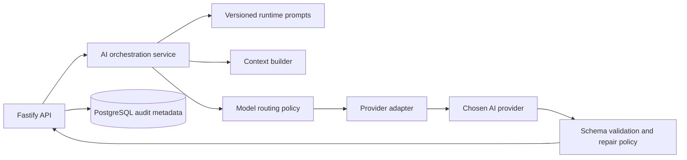

# AI architecture

## Goal

The AI layer must be replaceable, predictable, private, and inexpensive to operate for a small private deployment. Product code describes intent—“request Lawyer coaching” or “judge this completed debate”—rather than depending on a particular provider’s API.

## Components

## Request flow

1. The API authorises the user and verifies the debate state.
2. The orchestration service identifies the role and assigned side.
3. It loads the applicable prompt layers from `prompts/`.
4. The context builder creates the smallest sufficient context.
5. The routing policy selects the configured model for that role.
6. The provider adapter performs the provider-specific request.
7. The server validates the response against its contract.
8. The server stores only the appropriate result and metadata, then returns it to the authorised client.

## Trust boundaries

AI output is external, fallible input. It must never directly change debate state, award a winner, publish a message, access another participant’s private Lawyer exchange, or execute instructions embedded in user text. The API remains authoritative.

## Privacy boundary

A Lawyer request may include its participant’s request, the permitted debate context, and their side. It must not include the opponent’s Lawyer conversations. A Judge can read the final public transcript and permitted debate metadata, but not private coaching content unless a future, explicitly approved policy says otherwise.

## Failure behaviour

- If a Lawyer call fails or returns invalid output, tell the requesting participant that coaching is unavailable and allow the debate to continue.
- If a Judge call fails, keep the debate in `judging`, record the failure, and provide a retry path to an authorised operator. Do not fabricate a report or mark the debate completed.
- If output is incomplete or malformed, apply a bounded repair/retry policy only if it does not change the input or leak data. Otherwise reject it.
