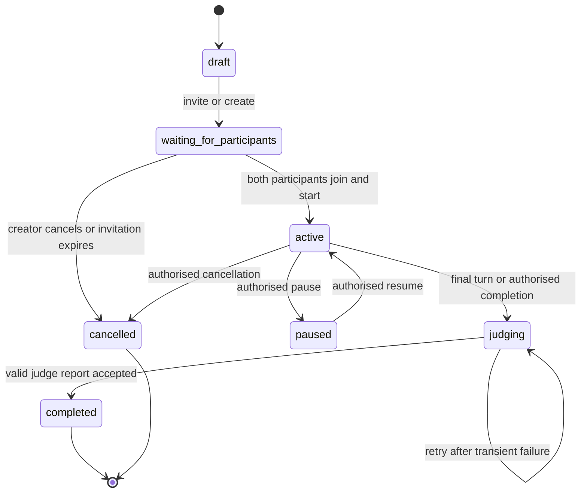

# Debate lifecycle

## Purpose

The debate lifecycle is a server-enforced state machine. Clients may request an action, but only the API may transition a debate, choose the active speaker, start a timer, or make a report available.

## States

## State definitions

| State | Meaning | Permitted main actions |
| --- | --- | --- |
| `draft` | creator is configuring a debate | edit configuration, invite, cancel |
| `waiting_for_participants` | invitation exists; one or both places remain unready | join, decline, cancel |
| `active` | the debate is in progress | submit current turn, request Lawyer help, raise hand, pause where authorised |
| `paused` | no turn timer or message submission proceeds | resume or cancel where authorised |
| `judging` | transcript is locked and awaiting a validated Judge report | retry judging by authorised system/operator only |
| `completed` | final report is available | view, export, import as later reference |
| `cancelled` | debate ended without a completed report | view limited record/export if policy allows |

## Turn model

An active debate has an ordered list of turns. A turn identifies the allowed side, round, start time, deadline, message limit, and completion status. The API accepts a public message only if:

1. the sender is a participant in this debate;
2. the debate is active;
3. the sender owns the active turn;
4. the turn has not expired or been closed; and
5. the message satisfies validation and conduct rules.

After accepting a valid message, the API closes the turn, records the message immutably, selects the next configured turn, and broadcasts the state change.

## Raise-hand request

A participant may create a raise-hand request during the opponent’s turn. This is a request, not an interruption and not permission to post. The future moderator/flow policy determines whether it is granted, declined, expires, or becomes the next allotted turn. Its decisions must be persisted for audit.

## Completion and judging

The debate enters `judging` when its configured final turn ends, both sides agree to conclude under a defined policy, or an authorised termination requires a report. The transcript is then locked. Only a validated Judge response can transition it to `completed`.

## Open implementation details

The final round templates, pause permissions, timeout policy, and raise-hand grant mechanism remain in [Open questions](../QUESTIONS.md). Do not improvise them in the client.
