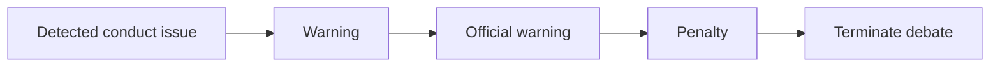

# Debate moderation

## Objective

Moderation protects participants and preserves a usable debate. It targets conduct, not viewpoints. Disagreement or controversial subject matter alone is not a violation.

## Prohibited conduct

- threats, incitement, or encouragement of imminent harm;
- hate speech or discriminatory harassment;
- repeated personal insults or targeted harassment;
- spam, flooding, or deliberate disruption;
- repeated attempts to evade turn controls or platform restrictions; and
- persistent refusal to engage constructively after warnings.

## Enforcement ladder

The ladder is a default, not a requirement to tolerate serious harm. Severe threats, hate, or safety-critical content may justify immediate termination.

## Authority and records

The API applies enforcement. The Judge may identify conduct in a final report; a future Moderator may make live recommendations. Neither model directly changes state without server policy checks.

Every action must record the public message or event, rule category, action, timestamp, actor/system source, and short explanation. Private Lawyer content must not be exposed to an opponent as moderation evidence.

## Termination

On termination, public message submission stops, the reason is shown to participants, and the transcript is preserved according to retention policy. Whether a terminated debate receives a limited Judge report is an open policy decision; the system must not imply a normal competitive result without sufficient transcript.
