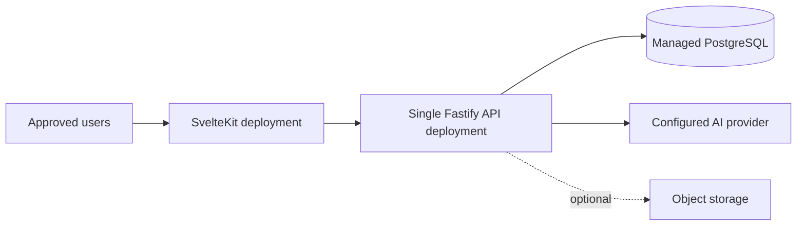

# Deployment

## Initial deployment posture

Debatr is a private application for up to ten users. Deploy a simple web application and a single API instance with managed PostgreSQL. Do not add distributed infrastructure merely in anticipation of growth.

## Candidate topology

Vercel, Neon, Cloudflare R2, and a self-hosted VPS/Coolify option were mentioned in earlier planning, but none is yet a final infrastructure decision. Select services based on private-access support, WebSocket compatibility, cost, backups, regional/privacy needs, and ease of secret management.

## Deployment requirements

- Use separate development and production environments/databases.
- Configure explicit web/API origins and enforce HTTPS.
- Apply database migrations as a controlled deployment step.
- Validate environment configuration before accepting traffic.
- Restrict access to approved users and administrative interfaces.
- Configure backups and test a restoration procedure before storing real debate data.
- Record deployment version, schema version, and prompt version for troubleshooting.

## Release process

1. Review changes and run the required checks.
2. Deploy to a non-production environment when available.
3. Apply reviewed migrations with a backup/rollback plan.
4. Deploy the API and web application.
5. Smoke-test authentication, debate access, turn submission, WebSocket reconnect, private Lawyer isolation, and Judge report retrieval.
6. Monitor logs/errors without collecting secrets or unnecessary transcript content.

## Rollback

Application rollback must be planned separately from database rollback. Do not reverse a migration blindly after data has been written. Prefer additive, backward-compatible migrations and explicit recovery steps.
